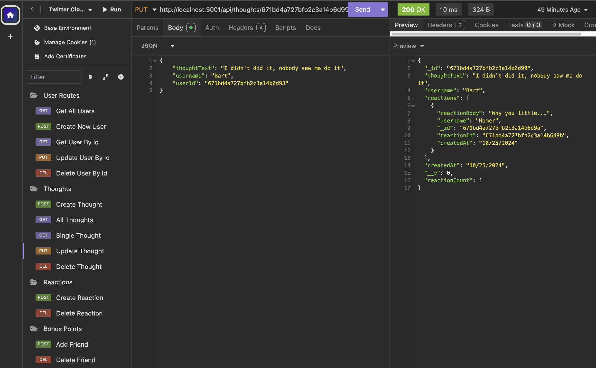

# NoSQL Challenge

[](https://opensource.org/licenses/MIT)

## Description

API for a social network web application where users can share their thoughts, react to friends’ thoughts, and create a friend list. API uses Express.js for routing, a MongoDB database, and the Mongoose ODM.

## Table Of Contents

- [Installation](#installation)
- [Usage](#usage)
- [License](#license)
- [Contributing](#contributing)
- [Tests](#tests)
- [Questions](#questions)

## Installation

1. Install by running `npm i` in the terminal.

2. Seed the database from the terminal by running `npm run seed`

## Usage

### Initialize App From Terminal

```sh
npm run dev
```

## API Routes

### User Requests

- `http://localhost:3001/api/users/` GET to View All Users
- `http://localhost:3001/api/users/:id` GET to View User By Id
- `http://localhost:3001/api/users/` POST to Create a New User
- `http://localhost:3001/api/users/:id` PUT to Update a User By Id
- `http://localhost:3001/api/users/:id` DELETE to Delete a User By Id

- Example Payload For POST

```sh
{
  "username": "Bart Simpson",
  "email": "bart@simpson.com"
}
```

### Friend Requests

- `http://localhost:3001/api/users/:id/friends/:id` POST to Add a New Friend to a User's Friend List
- `http://localhost:3001/api/users/:id/friends/:id` DELETE to Delete Friend From User's Friend List

### Thought Requests

- `http://localhost:3001/api/thoughts` GET to View All Thoughts
- `http://localhost:3001/api/thoughts` POST to Create a New Thought
- `http://localhost:3001/api/thoughts` PUT to Update a Thought By Id
- `http://localhost:3001/api/thoughts` DELETE to Delete a Thought By Id

- Example Payload For POST/PUT

```sh
{
  	"thoughtText": "Eat My Shorts!",
    "username": "Bart",
		"userId": "671bcf8c4ec542f1ba519e5d"
}
```

### Thought Requests

- `http://localhost:3001/api/thoughts/:id/reactions` POST to Create a New Reaction to a Thought
- `http://localhost:3001/api/thoughts/:id/reactions` DELETE to Delete a Reaction by Id

```sh
{
   	"reactionBody": "Ay Carumba!",
		"username": "Bart"
}
```

### Video Walkthrough

To see the application working from Insomnia please refer to the link below.

[YouTube.com](https://www.youtube.com/watch?v=VU-fFj3AiWA)

### Screenshot



## License

This project is licensed under the MIT license.

## Contributing

We welcome contributions from the community to help improve this project. Please refer to the contribution guidelines here.

## Tests

Please run "npm test" if test scripts are defined in the package.json file.

## Questions

- Feel free to contact me on Github [rich-strain](https://github.com/rich-strain) or [richardstrain@gmail.com](mailto:richardstrain@gmail.com)
